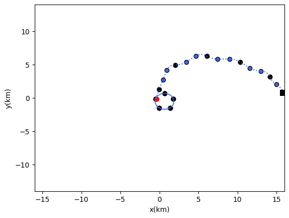
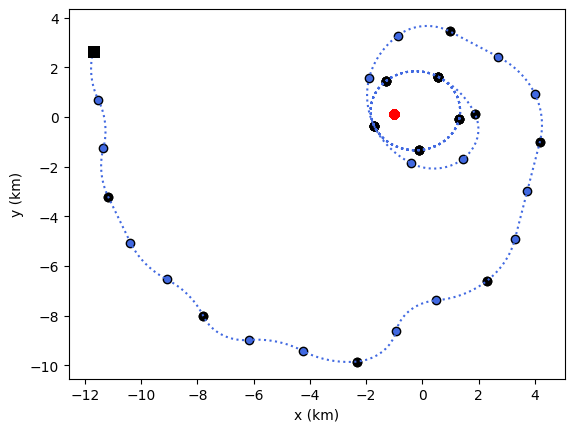
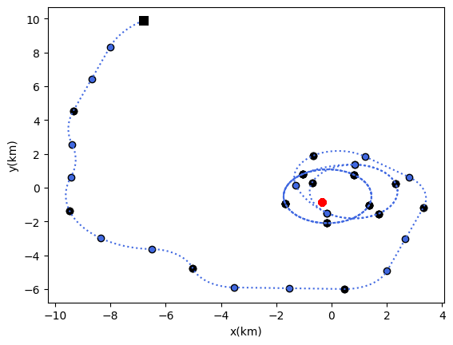
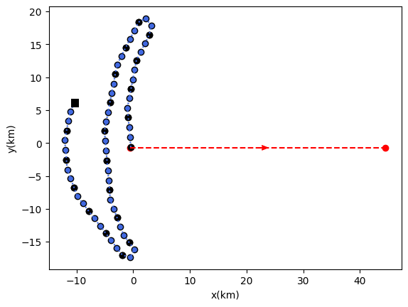

# viking-code

## Project Overview

The objective of this Ph.D. is to study optimal control problems in a partially observed
 discrete-time framework. In particular, we are interested in the stochastic optimal control
 problem for estimating the position of an underwater target from noisy measurements
 coming from a sensor owned by an underwater observer. We propose to use the Markov
 Decision Process (MDP) formalism, which is a family of controlled processes particularly
 well suited to modelling sequential stochastic optimisation problems. From a theoreti
cal point of view, PDMs have been studied very intensively in the literature. There are
 numerous techniques for establishing theoretical results showing the existence of optimal
 strategies or characterising the properties of the value function. These techniques are
 centred around dynamic programming and linear programming. However, it should be
 emphasised that such approaches do not provide either explicit solutions (except for very
 specific cases) or approximations of these optimal solutions, particularly in the context of
 partial and noisy observations. This thesis focuses on developing new theoretical/nu
merical approaches to approximation techniques for solving partially observed PDMs,
 analysing the problem of localisation and tracking in the plane and in a context of angu
lar observations, analysing the convergence of the proposed approximation schemes and
 implementing an algorithm for solving the problem described at the beginning of this
 paragraph.
 
For a more detailed overview with mathematical background and the algorithm explanation, see the thesis manuscript [here](https://theses.hal.science/tel-04889756) [[1]](#1) (The manuscript is written in French due to industrial obligations).
And a paper published in the MMOR journal [here](https://hal.science/hal-04568986v1) [[2]](#2)

<a id="1">[1]</a> 
R. Namyst. "Contrôle optimal stochastique et application à la trajectographie passive." Mathématiques [math]. Université de Bordeaux, 2024.

<a id="2">[2]</a> 
F. Dufour, A. Genadot, R. Namyst. "The Bearing Only Localization Problem via Partially Observed Markov Decision Process." 2024. 

## Brief problem description

## Results
The target is in red, the observer is following the blue path and has the black square as initial position. 

This is the perfect case where the position of the target is known.

### Case where target is non-moving and of unknown whereabout

### Case where the target is moving and of unknown whereabout

